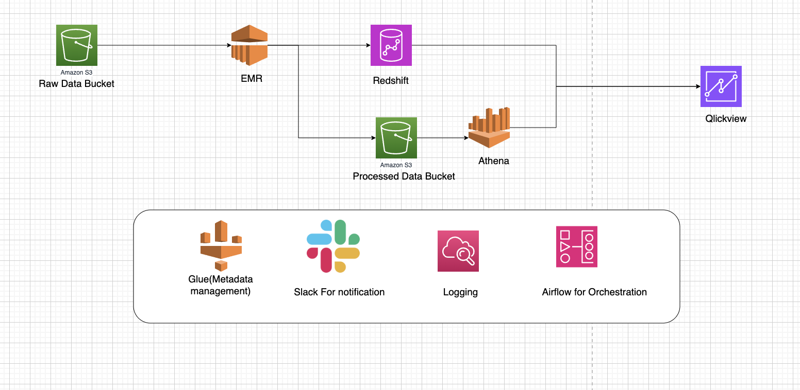
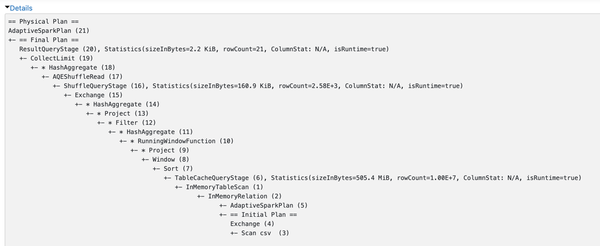
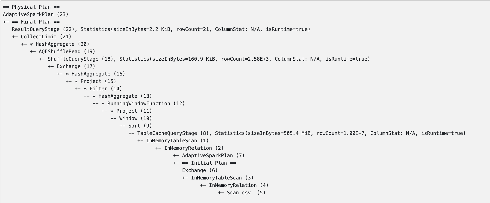

## **GoodNotes Data Engineering Pipeline**

---

## **Project Overview**

This project presents an optimized Spark-based data engineering pipeline tailored to calculate daily active users, monthly active users, and session-based metrics. It has been implemented for large-scale datasets and includes advanced optimizations and best practices for performance, scalability, and maintainability. 

---

## **Source Code**

The repository includes the following key files:

1. **Data Processing Code**:
   - **`data_process_v3.py`**: Contains the logic for calculating DAU and MAU metrics and implements session-based metric calculations.
  

2. **Tests**:
   - **`test_data_process_v2.py`**: Unit tests for validating the core functionalities of DAU/MAU and session metric calculations.


---

## **Approach**

### **1. Calculating DAU/MAU**
- **Definition**:
  - **DAU**: Users with at least one action on a given day.
  - **MAU**: Users with at least one action in a 30-day rolling window.
- **Implementation**:
  - Use `groupBy` and `approx_count_distinct` for DAU.
  - Leverage **window functions** for rolling calculations of MAU.

### **2. Session-Based Metrics**
- **Definition**:
  - Sessions are defined as sequences of user actions with a gap of no more than 30 minutes between consecutive actions.
- **Metrics**:
  - **Average Session Duration**: Total session time / number of sessions.
  - **Actions per Session**: Total actions / number of sessions.
- **Outlier Handling**:
  - Apply the **IQR method** to filter out unusually long sessions or high action counts.

---

## **Optimizations**

### **1. Query Optimizations**
- **Adaptive Query Execution (AQE)**:
  - Enabled AQE for dynamic partitioning and skew handling.
- **Pushdown Filters**:
  - Ensured early filtering to minimize unnecessary data processing.
- **Approximate Aggregations**:
  - Used `approx_count_distinct` for faster distinct count calculations.

### **2. Partitioning**
- **Daily Partitioning**:
  - Data is partitioned by `date` to support efficient time-based queries.
- **Range Partitioning**:
  - Applied `repartitionByRange` on `user_id` to reduce shuffles.

### **3. Data Storage**
- Stored processed data in **Parquet** format with **Snappy compression** for efficient storage and I/O performance.

---

## **Analysis of Results**

### **1. DAU/MAU**
- **DAU**:
  - Fluctuated between 13,000 and 13,500 users per day, indicating consistent daily engagement.
- **MAU**:
  - Grew steadily to 267,618 by the end of the observation period, reflecting strong user retention.

### **2. Session Metrics**
| Metric                  | Value        |
|-------------------------|--------------|
| **Total Valid Sessions**| 2,676        |
| **Unique Users**         | 2,670        |
| **Avg. Session Duration**| ~15 minutes  |
| **Actions per Session**  | 2.0          |

### **3. Insights**
- **Engagement**:
  - Consistent session durations indicate predictable user behavior.
- **Opportunities**:
  - Gamified features could increase session durations.
  - UX improvements could encourage more actions per session.

---

## **Challenges Faced and Solutions**

1. **High Shuffle Costs**:
   - **Solution**: Used range partitioning and broadcast joins to minimize shuffles.

2. **Handling Outliers**:
   - **Solution**: Applied IQR-based thresholds to filter abnormal session durations and action counts.

3. **Large Dataset**:
   - **Solution**: Leveraged partition pruning and compression to reduce the volume of scanned data.

4. **Window Function Overhead**:
   - **Solution**: Pre-sorted data to optimize window function execution.

---

## **Unit Testing**

### **Coverage**
- Validated DAU and MAU calculations with mock data.
- Tested session boundary logic for edge cases like midnight crossovers and long gaps.
- Verified data partitioning and storage correctness.

### **How to Run Tests**
1. Install dependencies:
   ```bash
   pip install -r requirements.txt
   ```
2. Run tests:
   ```bash
   pytest test_pipeline.py --disable-warnings
   ```

---

## Data Storage Strategy

- **Daily Partitioning**: Store interaction data in daily partitions for efficient query filtering.
- **Range Partitioning**: Use range partitioning on user_id for session-based metrics.
- **Compression**: Apply Snappy compression to Parquet files for faster I/O operations.

### Recommended Data Layouts

- **Time-based queries**: /data/date=YYYY-MM-DD/
- **High-frequency events**: /data/date=YYYY-MM-DD/hour=HH/
- **User-centric analytics**: /data/user_id_partition=X/
- **Hybrid (time + user)**: /data/date=YYYY-MM-DD/user_id=X/

## **System Architecture**

### **Components**
1. **Amazon S3 (Raw & Processed Buckets)**
   - **Raw**: Unprocessed data storage.
   - **Processed**: Transformed and partitioned data for analytics.
   - **Optimization**: Use Parquet/ORC with compression and lifecycle policies.

2. **EMR**
   - Processes data using Spark, writes results to S3/Redshift.
   - **Optimization**: Enable AQE, use Spot Instances, and auto-scaling.

3. **Glue & Athena**
   - **Glue**: Manages metadata for S3 data.
   - **Athena**: Queries processed data directly from S3.
   - **Optimization**: Automate schema updates and enable partition projection.

4. **Redshift**
   - Stores processed data for advanced analytics and BI integration.
   - **Optimization**: Use Spectrum for querying S3 directly and enable materialized views.

5. **CloudWatch & Airflow**
   - **CloudWatch**: Monitors and logs pipeline performance.
   - **Airflow**: Orchestrates pipeline jobs and sends Slack notifications.
   - **Optimization**: Add DAG versioning and integrate error alerts with actionable logs.

## Improvements

- **Delta Lake**: For ACID transactions and schema evolution.
- **Deequ**: For automated data quality checks.
- **Dynamic Partitioning**: To optimize data scans.
- **Grafana**: For real-time monitoring and visualization.
- **EMR**: Use Spot Instances for EMR to reduce costs.
- **S3 lifecycle**: Configure S3 lifecycle policies to archive infrequently accessed data.

---

### **Architecture Diagram**


---

## **Dependencies**

### **`requirements.txt`**
```
pyspark==3.3.1
pytest==7.2.0
boto3==1.26.0
```

---

## **Spark UI Screenshots**

The first screenshot represents the physical plans for the V1 and V3 code, respectively.

In V3, we calculate outlier thresholds using the IQR method with added optimizations.






### Observations from the plans above:
1. **Exchange Operations**:  
   - Both plans involve data shuffling, which is expensive. Reducing unnecessary shuffles improves performance.  

2. **InMemoryTableScan**:  
   - Caching is used, but the cached data size is significant (505.4 MiB with 10M rows). Efficient caching is crucial.  

3. **HashAggregate**:  
   - Multiple stages suggest intermediate aggregation. Consolidating these can improve performance.  

4. **CollectLimit**:  
   - Efficient but should be pushed down earlier to minimize computation.  

5. **Adaptive Query Execution (AQE)**:  
   - AQE is utilized, which helps optimize runtime operations like joins and partition sizes.  

6. **Window Functions**:  
   - Sorting in window functions is expensive. Optimizing partitioning can reduce overhead.  

---

### Optimizations:
1. **Reduce Data Shuffling**:  
   - Use broadcast joins for small datasets.  
   - Optimize partitioning strategies to minimize shuffles.  

2. **Optimize Caching**:  
   - Cache only minimal and relevant data. Filter unnecessary columns/rows before caching.  

3. **Optimize Aggregations**:  
   - Consolidate multiple HashAggregate steps. Use pre-aggregated data where possible.  

4. **Push Down Limits/Filters**:  
   - Apply `CollectLimit` and `Filter` operations early in the query plan.  

5. **Partition Tuning**:  
   - Ensure even partition sizes to avoid skew and improve processing efficiency.  

6. **Window Function Optimization**:  
   - Filter data before applying window functions. Use optimized partitioning to reduce shuffle overhead.  

7. **AQE Settings**:  
   - Enable dynamic partition pruning.  
   - Adjust shuffle partition size thresholds (`spark.sql.adaptive.shuffle.targetPostShuffleInputSize`).  

---

## **Conclusion**

The optimized pipeline has shown great improvements for performance, scalability, and resource use. It's able to efficiently manage very large datasets with its robust design ready for the production deployment. Additional information and explanations are provided in the attached architecture diagrams and Spark UI screenshots. 